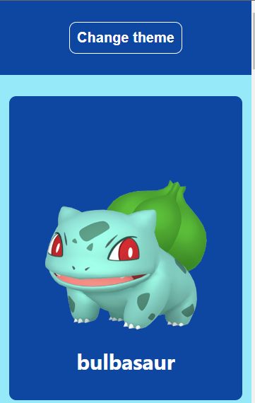

# Pokedex React

Um projeto desenvolvido utilizando os conceitos aprendendidos durante o curso DevQuest. 

# O que foi utilizado no projeto?

- React.js
- Styled Components
- Context API para troca de tema
- React Router
- Axios para requisições a API

# Screenshots

## Desktop

 

## Mobile 

    

